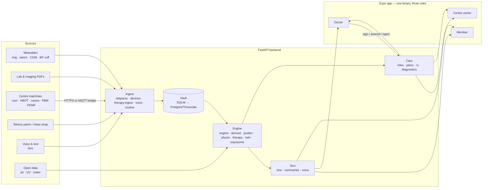

# Architecture

## Principles

1. **The Vault is the product.** Every value carries its source, timestamp and (where inferred) confidence — provenance is a schema property.
2. **Event-first.** Events (meals, drinks, cigarettes, therapies, medicines, travel, life events) are first-class rows the engine regresses on.
3. **Drafts, then a clinician signs.** Anything medical-adjacent (insights, monthly reports, therapy plans, Rx, report summaries) is a draft until a
   registered clinician signs it; the person sees the trail.
4. **Honest outputs.** "No reliable signal" and "too early" are valid answers; uncertainty is shown; simulated data is labelled as simulated.
5. **Deterministic safety outside the model.** Contraindications, interaction checks and machine/physiology alarms are rules, never LLM output.

## Backend modules (`backend/app`)

| Module | Responsibility |
|---|---|
| `main.py` | All HTTP routes (FastAPI); lifespan initialises tables and seeds an empty DB |
| `config.py` | Loads `backend/.env`; settings |
| `db.py` | SQLite access helpers and the core schema |
| `catalog.py`, `catalog_ext.py`, `catalog_more.py` | 221 markers, 21 panels, zones, evidence grades, concerns, retest rules, action library |
| `labparse.py` | PDF → markers (cell-per-line and line layouts), panel routing by marker majority |
| `engine.py` | Latest values, PhenoAge, domain scores, adjusted event effects, correlations, cross-modality rules, insights, N-of-1 |
| `derived.py` | Derived markers (FIB-4, eGFR, ratios), zones, risk matrix, action plan, retest nudges |
| `predict.py` (+ `prevent_coef.json`) | PREVENT 2024, PCE, ADA, FIB-4, KFRE, what-if |
| `physio.py` | In-session physiology priors (ODE), session analytics, safety tiers, literature validation |
| `therapy.py` | Therapy catalogue, devices, safety screen, verdicts, plans, live floor, phenotypes, HSAI |
| `devices.py` | Machine keys, telemetry ingest, delivered-vs-prescribed, telemetry-driven priors |
| `twin.py` | Digital twin: state, calibration, simulation, 24-h twin, mirror |
| `diagnostics.py` | Tests & scans catalogue and recommendations |
| `rx.py` | Telomy Formulas / supplements / medicines / IVs, interactions (curated + DDInter), sign-off, orders, e-prescription |
| `summaries.py` | AI summaries for reports and patients (grounded composer) |
| `sinc.py` | Chat: Claude (structured output) or grounded retrieval; deep-research citations (`evidence.py`) |
| `voice.py` | Whisper transcription, multilingual intent engine, voice-stress acoustics |
| `routine.py` | Free-text routine → schedule, metrics, daily confirmations |
| `activities.py` | Custom activities, baselines, insights |
| `exposome.py` | City exposures (Open-Meteo / CAMS), personal effects, city comparison |
| `roles.py`, `plans.py` | Accounts, doctor panel, centre operations, subscriptions, monthly reports, consults |
| `features.py`, `food.py`, `brief.py` | Dashboard, meds, notifications; food analysis; specialist briefs (PDF + FHIR) |
| `seed.py` | Builds the fictitious test Vault with documented ground-truth effects |

## Mobile (`mobile/src`)

- `app/` — expo-router file routes. `(tabs)` = member (Home · Vault · Therapy · Plan · Sinc · Profile); `doctor/` and `centre/` tab groups;
  ~75 stack screens (therapy, session, twin, voice, routine, rx, tests, review…).
- `ui/` — design-system components (`core.tsx`), charts, therapy/session charts, insight cards, role tabs.
- `lib/` — `api.ts` (base URL from `EXPO_PUBLIC_API_URL` or the Metro host), `theme.ts` (Cloud Dancer / Ink tokens, Inter + Fraunces), `role.tsx`.

## Data flow examples

- **Lab PDF** → `POST /labs/parse` (preview) → `POST /labs/save` → engine regenerates insights → doctor sees an AI summary in Work queue.
- **Cryo session** → machine streams `POST /devices/CRY-1/telemetry` → patch uploads `POST /therapy/sessions/{id}/samples` → session analytics →
  next-night effects via the engine → verdict on the Therapy tab → doctor sees it on the patient page.
- **"Had 120 ml vodka at 9"** (voice) → `POST /voice/audio` → Whisper → intent `alcohol` → event row → twin and engine use it tonight.

## Production path (not yet built)

SQLite → Postgres + TimescaleDB; object storage for PDFs/DICOM; auth (OTP + role claims) and per-patient access control;
background workers for parsing/insights; India-region hosting (DPDP data residency); audit log export. See [ROADMAP](ROADMAP.md).
